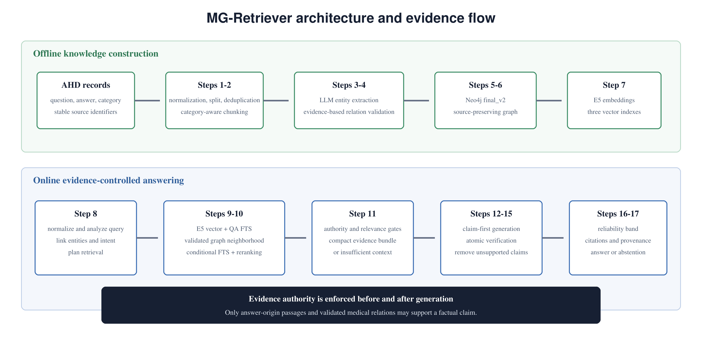

# MG-Retriever: Arabic Medical Graph-RAG

MG-Retriever is an evidence-aware Arabic medical question-answering pipeline built
on Neo4j, multilingual E5 retrieval, conditional full-text QA search, grounded
LLM generation, claim verification, hallucination mitigation, reliability scoring,
and explainable citations.

The published snapshot is **`final_v2`**. This repository begins at the entity and
relation hand-off: upstream data preparation and initial extraction were performed
by a collaborator. The work retained here validates and consolidates that hand-off,
extends the graph, imports it into Neo4j, builds embeddings, implements Steps 8-17,
and evaluates the frozen system.

> **Research prototype:** This system is not a medical device and must not replace
> professional diagnosis or treatment. Its reliability scores are internal signals,
> not calibrated clinical probabilities.



## Final System

```text
Arabic question
  -> Step 8: normalization, one-call query analysis, entity linking, retrieval plan
  -> Step 9: E5 vector + validated graph + QA + conditional FTS retrieval
  -> Step 10: identity/intent/anatomy-aware deterministic reranking
  -> Step 11: selective, provenance-preserving evidence context
  -> Step 12: grounded GPT-OSS-20B claim-first generation
  -> Step 13: atomic claim extraction
  -> Step 14: deterministic evidence and safety verification
  -> Step 15: unsupported-claim removal and answerability state
  -> Step 16: reliability score
  -> Step 17: answer, citations, provenance, limitations, and audit trail
```

Production uses `intfloat/multilingual-e5-base`, Groq
`openai/gpt-oss-20b`, the `grounded_claim_first_v3_1` prompt, and the
`deterministic_v3` verifier. The supplemental graph, learned reranker, semantic
verifier overrides, cross-encoder rescue, and forced extractive fallback are not
enabled.

## Frozen Graph

| Record | `final_v2` count |
|---|---:|
| Medical entities | 4,532 |
| Evidence mentions | 10,657 |
| QA records | 4,139 |
| Direct medical relations | 2,064 |
| Direct + inverse Neo4j relations | 4,128 |
| Embedded documents | 19,328 |

The graph contains four entity types (`DiseaseCondition`, `Symptom`, `Treatment`,
and `Test`) and four direct relation types (`HAS_SYMPTOM`, `TREATED_BY`,
`DIAGNOSED_BY`, and `INVESTIGATED_BY`). Referential-integrity and duplicate-ID
checks are all zero. The expansion snapshot covers 474 of 1,896 available chunks;
it is therefore a frozen research graph, not the complete 808k-record AHD corpus.

The immutable graph CSVs and Neo4j dump are distributed as release assets rather
than committed to Git. See `docs/ARTIFACTS.md` for asset names and restore paths.

## Evaluation Summary

The final evaluation uses 100 frozen AHD questions. Candidate relevance was
annotated independently of retrieval execution, but the final file identifies the
annotator as `GPT-5.6 Thinking`; these are model-adjudicated judgments, not
clinician-confirmed gold.

| Metric | Result |
|---|---:|
| Queries with a direct candidate | 64/100 |
| Direct hit rate@5 | 0.5000 |
| Useful hit rate@5 | 0.8600 |
| Judged-pool direct Recall@5 | 0.4035 |
| MRR | 0.3551 |
| Graded nDCG@10 | 0.6702 |
| Queries with non-empty Step 11 context | 75/100 |
| Substantive final answers | 30/100 |
| Retained verified claims | 42 |
| BERTScore F1 on substantive answers | 0.675518 |
| Citation validity on retained claims | 1.0000 |

The post-mitigation support rate of 1.00 and hallucination rate of 0.00 apply only
to the 42 retained claims across 30 substantive answers, not to all 100 questions.
The graph channel did not independently produce a label-2 direct answer in this
cohort; direct QA/evidence retrieval carried most answer coverage. Relation
triplet metrics remain unavailable because no independent relation ground truth
was completed.

See `docs/EVALUATION.md`. Filled AHD-derived cohorts and relevance labels are not
committed; the full retrieval, generation, claim-audit, and consolidated result
files are available separately to authorized collaborators.

## Repository Layout

```text
src/                     Production graph, retrieval, generation, and verification code
scripts/                 Graph construction and reproducible evaluation entry points
tests/                   Deterministic regression and safety tests
data/evaluation/         Annotation protocol only; populated cohorts are ignored
data/raw/                Local AHD source; ignored by Git
data/retrieval/          Generated SQLite FTS index; ignored by Git
docs/                    Architecture and evaluation documentation
```

Generated outputs, graph snapshots, database dumps, the manuscript, historical
caches, virtual environments, trial workspaces, and raw API request files are
intentionally not committed. Frozen deliverables are published separately so the
repository stays code-focused.

## Setup

Requirements: Python 3.11+, Docker Desktop, and enough memory to load multilingual
E5. The frozen run used Python 3.13 on Windows.

```powershell
py -3.13 -m venv .venv
.\.venv\Scripts\Activate.ps1
python -m pip install --upgrade pip
python -m pip install -r requirements.txt
Copy-Item .env.example .env
```

Set `GROQ_API_KEY` and `NEO4J_PASSWORD` in `.env`. Never commit `.env`.

## Restore `final_v2`

Download `final_v2_graph_csv.zip` from the project release and extract it to
`outputs/final_graph_v2/`. This directory is ignored by Git.

Start the isolated Neo4j service:

```powershell
docker compose up -d neo4j-final-v2
```

Import the versioned CSV graph into an empty database:

```powershell
python src\step05e_import_final_v2.py --dry-run
python src\step05e_import_final_v2.py --execute --batch-size 500
```

Alternatively, download `final_v2_neo4j_dump.zip`, the frozen portable database
backup, and verify it with its adjacent SHA-256 file before restoring it.

Build or verify the E5 vectors and Neo4j indexes:

```powershell
python src\step06_build_embedding_indexes.py --graph-version final_v2 --dry-run --skip-model-load
python src\step06_build_embedding_indexes.py --graph-version final_v2 --execute --batch-size 32
```

## Optional Full-AHD QA Index

The 396 MB `data/raw/AHD.csv` and generated SQLite FTS database are excluded from
GitHub. Place the licensed/source dataset at `data/raw/AHD.csv`, then run:

```powershell
python scripts\step09a_build_qa_corpus.py
python scripts\step09a_build_qa_corpus.py --execute
```

The builder excludes the frozen evaluation questions before creating
`data/retrieval/ahd_qa_train_v1.sqlite`.

## Run a Query

```powershell
python src\step17_build_explainable_output.py `
  --graph-version final_v2 `
  --query "ما علاج الربو؟"
```

Use `--context-only` to stop after Step 11 without calling the answer-generation
API.

## Reproduce the Final Evaluation

After obtaining the authorized evaluation inputs and frozen output bundle, extract
the outputs to `outputs/evaluation/`. The frozen JSONL files then allow reported
metrics to be recomputed without repeating paid API calls:

```powershell
python scripts\evaluate_final_v2_relevance.py `
  --labels path\to\final_v2_candidate_relevance_labels_100_annotated.csv `
  --queue path\to\final_v2_candidate_relevance_labels_100.csv `
  --retrieval outputs\evaluation\retrieval\final_v2_ahd_reference_100_conditional_fts_20260803\vector_graph_conditional_fts.jsonl `
  --generation outputs\evaluation\generation\final_v2_ahd_reference_100_steps12_17_20260803\full_pipeline.jsonl `
  --generation-metrics outputs\evaluation\generation\final_v2_ahd_reference_100_steps12_17_20260803\metrics.json `
  --output-dir outputs\evaluation\recomputed_final_v2
```

Use a new output directory because frozen artifacts are never overwritten.

## Verification

```powershell
python -m compileall src scripts
python -m unittest discover -s tests -v
```

## Manuscript

The reviewed manuscript PDF and its compilable LaTeX source are distributed as
`MG_Retriever_final_v2.pdf` and `MG_Retriever_final_v2_source.zip` release assets.
They are not part of the code repository.

## Data and Ethics

- Do not publish raw AHD data unless its license explicitly permits redistribution.
- Do not publish filled evaluation cohorts containing AHD questions, answers, or
  evidence unless redistribution has been approved.
- Evaluation questions and model outputs may contain sensitive medical language;
  use them only for research and avoid adding personal identifiers.
- API credentials are loaded from `.env` and are never stored in manifests.
- No open-source license has been selected because ownership is shared with the
  research collaborators and institution. Add a license only after their approval.
