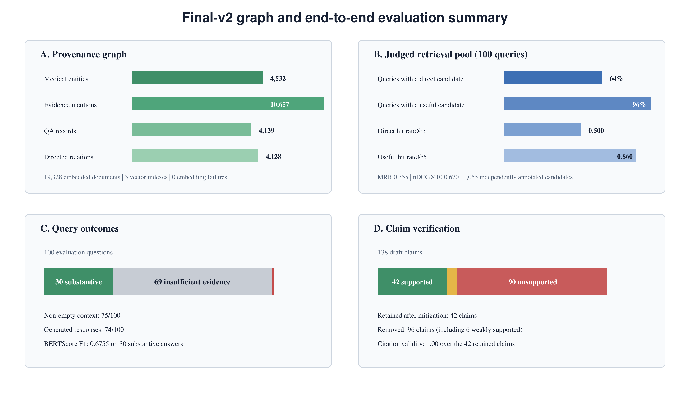

# Evaluation Protocol and Results

## Cohort and Independence

The final report uses the same frozen 100-question AHD cohort for controlled
`final_v1`/`final_v2` comparison. Exact normalized evaluation questions were
excluded from the external SQLite QA index. Retrieval and generation settings were
frozen before the final-v2 candidate judgments were joined back to outputs.

The candidate file contains 1,055 judgments over 99 candidate-bearing queries:
121 direct (`2`), 301 related or incomplete (`1`), and 633 irrelevant or unsafe
(`0`). Its metadata names `GPT-5.6 Thinking` as annotator. These labels are useful
for model-adjudicated evaluation but must not be presented as clinician-confirmed
gold.

## Retrieval

| Metric | Combined | Evidence only | Graph relations |
|---|---:|---:|---:|
| Direct hit@5 | 0.5000 | 0.5100 | 0.0000 |
| Useful hit@5 | 0.8600 | 0.8700 | 0.0300 |
| Judged-pool direct Recall@5 | 0.4035 | 0.4135 | 0.0000 |
| MRR | 0.3551 | 0.3651 | 0.0000 |
| Graded nDCG@10 | 0.6702 | 0.6835 | 0.0292 |

The recall denominator is limited to direct candidates within the exported judged
pool, not all relevant passages in AHD. FTS QA had the best direct-candidate yield
(16.5%), followed by conditional FTS (9.6%) and vector retrieval (9.5%). No graph
relation was judged directly answer-bearing in this cohort.

## Context and Generation

- Non-empty Step 11 context: 75/100 queries.
- Selected artifacts: 335, of which 287 were judged.
- Useful context precision among judged selected items: 0.5192.
- Direct context precision among judged selected items: 0.1742.
- Successful generation records: 74; fallbacks: 26.
- Substantive final answers: 30/100.
- Pre-mitigation claims: 138.
- Retained verified claims: 42; removed claims: 96.
- BERTScore F1: 0.675518 over 30 substantive answers.
- Citation validity: 1.0000 over 42 retained claims.
- Reliability: 1 high, 13 medium, 86 low.

The post-mitigation support rate of 1.00 and hallucination rate of 0.00 describe only
the retained claims after deterministic filtering. They are not independent safety
scores over all 100 questions.

## Known Limitations

- No independent relation triplet ground truth exists, so candidate recall and
  triplet precision/recall/F1 are unavailable.
- Relevance judgments are model-adjudicated, not clinician-confirmed.
- `final_v2` contains 4,139 QA records and a 474-chunk expansion snapshot, not the
  complete AHD corpus.
- A separate 81-claim development audit found that the deterministic verifier
  falsely rejected 67 otherwise valid claims, mainly through rigid intent checks.
  That audit diagnoses conservatism; it does not justify weakening safety gates.
- Reliability labels have not been calibrated against enough independent human
  outcomes for AUROC, AUPRC, or clinical probability interpretation.

## Authoritative Files

- Judgments: `data/evaluation/final_v2_candidate_relevance_labels_100_annotated.csv`
- Frozen outputs: `final_v2_evaluation_outputs.zip` in the project release.
- After extraction, retrieval, generation, claim-audit, and consolidated metrics
  retain their original paths under `outputs/evaluation/`.

